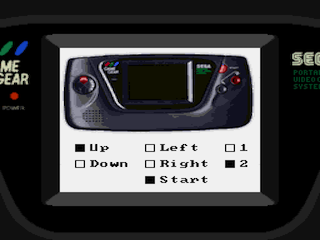

# InputTest
A Z80 assembler program to test D-pad, Start and other Buttons on a Sega Game Gear.

Displays a Game Gear device and checkboxes for each button. Pressed buttons indacated by checked boxes
and red sprites on the imags (see image below).

Toolchain (minimal):
* make
* wla-dx https://github.com/vhelin/wla-dx (Z80 assembler)
