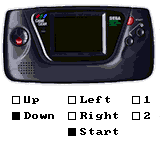

# InputTest
A Z80 assembler program to test D-pad, Start and other Buttons on a Sega Game Gear.

Displays a Game Gear device and checkboxes for each button.
Pressed buttons indicated by checked boxes
and red sprites on the image (see screenshot below).

Toolchain (minimal):
* make
* wla-dx https://github.com/vhelin/wla-dx (Z80 assembler)

IDE (used to integrate command line tools above, an emulator to test and Git):
* Qt Creator on OS X, http://www.qt.io/ide/

Tested on emulators
* Kega Fusion Emulator (OS X), http://www.carpeludum.com/kega-fusion/
* SMS Plus (OS X, screenshot above), http://www.bannister.org/software/sms.htm
* Osmose via RetroPie on Raspberry Pi, http://blog.petrockblock.com/retropie/

And tested on real hardware
* via EverDrive GG

Inspired by Maxim’s World of Stuff (SMS Tutorial)
http://www.smspower.org/maxim/HowToProgram/Index
